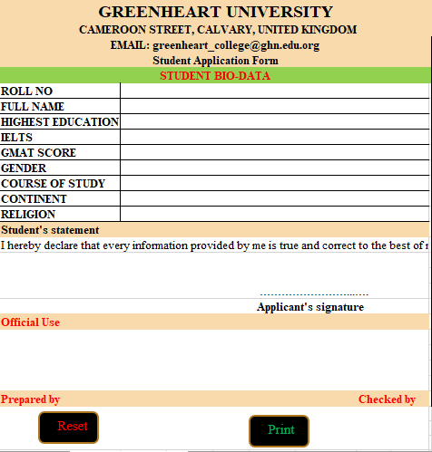
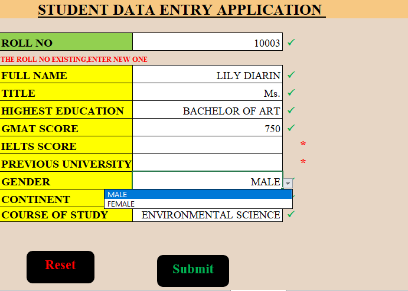
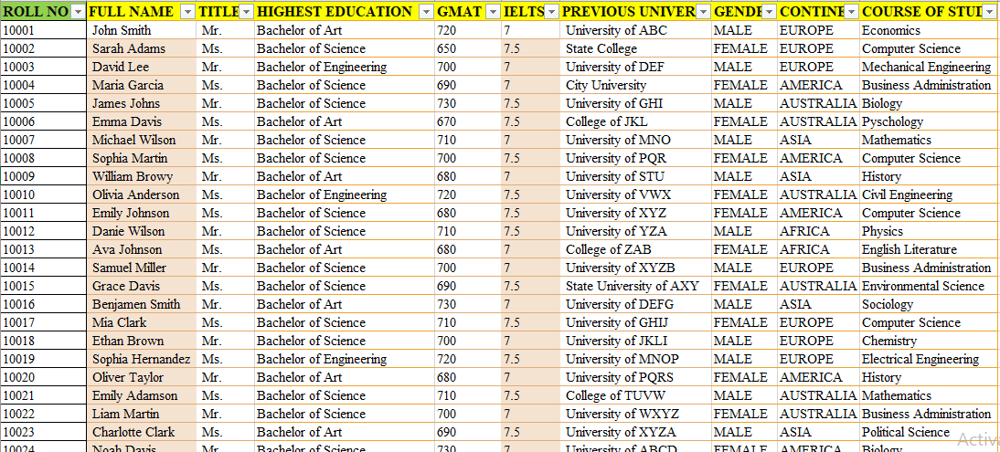
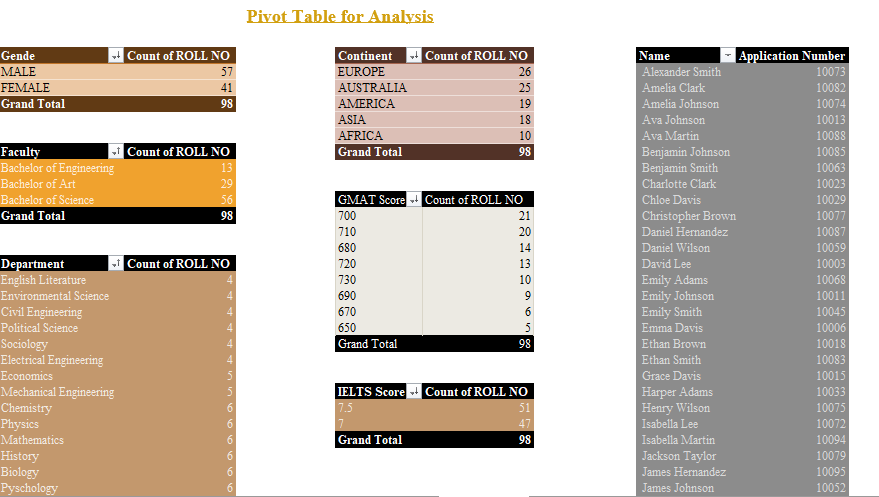
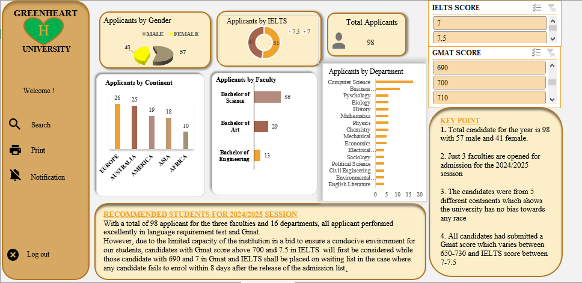

# Admission-Process
## Introduction
This was a school data in Microsoft Word I worked on not too long ago by converting from Ms word to Excel. I decided to make use of the data to perform further analysis. Interact with the full spreadsheet [here](https://drive.google.com/drive/folders/1mc2gzcpcdlg3AmgdxUot13jOYZLJoj7p) 

## Skills/Concept Demonstrated
- Macro
- Copy & pasting 
- Data validation
- Excel Formulas(IF, IFERROR) 
- Pivot Table

## Visualization 
Created student application form and used macro to automate the printing

 With the use of data validation and some excel functions, I created student data entry form and submitted using macro.
 

 The automated submitted form results to student data spreadsheet. 
 

Pivot table analysis was created from the student data spreadsheet

Created a Dashboard to help the school make a decision for 2024/2025 admission list

## Analysis
  a. Total applicants for 2024/2025 session: 98 (47 Female & 51 Male)
  
  b. The candidates applied to 3 faculties: Bachelor of science, art and engineering
  
  c. A total of 12 department were applied to with Computer science having the highest number with 17 applicants
  
  d. All applicants made between 650-730 and 7-7.5 for Gmat and IELTS score respectively
  
  e. Candidates with GMAT score >= 700 is 64 with IELTS Score of 7.5 = 30 and 7=34 respectively
  
  f. Candidates with GMAT score <= 670-690 is 34

## Conclusion and Recommendation
 Due to the limited capacity of the university, the 64 applicants with GMAT score between 700-730 shall be considered first while every other applicants shall be placed on waiting list. 
 
 However, applicant that fails to accept and pay the enrolment fee within one week shall forfeit the admission and slot will be taken by the next best applicant in the department. 
